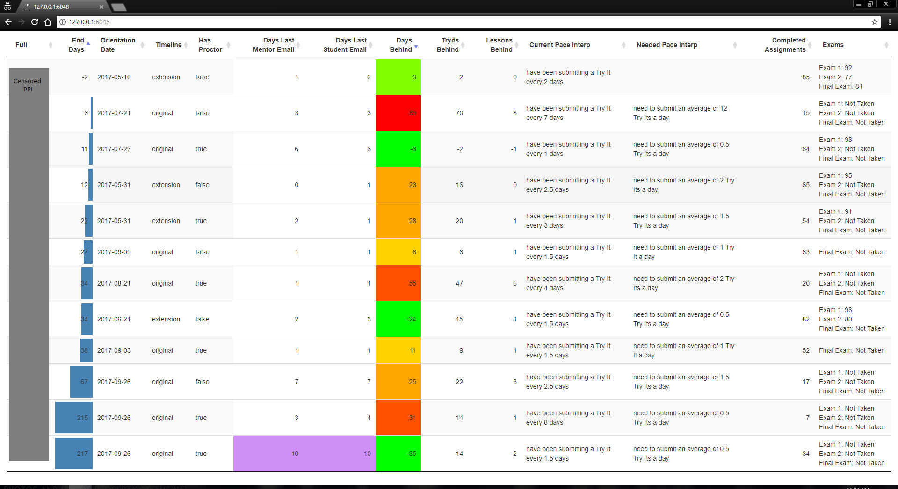

# netmathtools2

[](https://travis-ci.org/McClellandLegge/netmathtools2)

## Installation:

Windows 7/8/10 only.

```R
devtools::install_github("McClellandLegge/netmathtools2")
```

Additionally:

* Must have Python 3.6.* installed and added to the path
    * Suggest installing to `C:/Python36` instead of the default 
* Must have downloaded and installed the [pywin32](https://sourceforge.net/projects/pywin32/) python module
    * The bitness of this installer must match that of the Python 3.6 install
   
## Example Workflow:

Must log into Nexus with Chrome! The package automatically uses these cookies.

```R

my_netid     <- "mkemp6"

# retrieve cookies from Chrome, decrpyt and compose a `curl` handle
handle       <- netmathtools2::composeNexusHandle(my_netid)

# retrieve my student list and any static information about the students
students     <- netmathtools2::getStudents(handle, my_netid)

# retrieve grade and schedule information, calculate the progress in the course
# NOTE: handle may have timed out at this point, so just compose a new one if so:
#   handle <- netmathtools2::composeNexusHandle(my_netid)
student_prog <- netmathtools2::getStudentsProgress(handle, students)

# customize the columns I'd like to see
customized_student_prog <- student_prog[, .(
  full
  , end_days
  , orientation_date
  , timeline
  , has_proctor
  , days_last_mentor_email
  , days_last_student_email
  , days_behind
  , tryits_behind
  , lessons_behind
  , current_pace_interp
  , needed_pace_interp
  , completed_assignments)
  ]

# run a shiny app displaying an interactive DataTableJS
netmathtools2::chartProgress(customized_student_prog)
```




